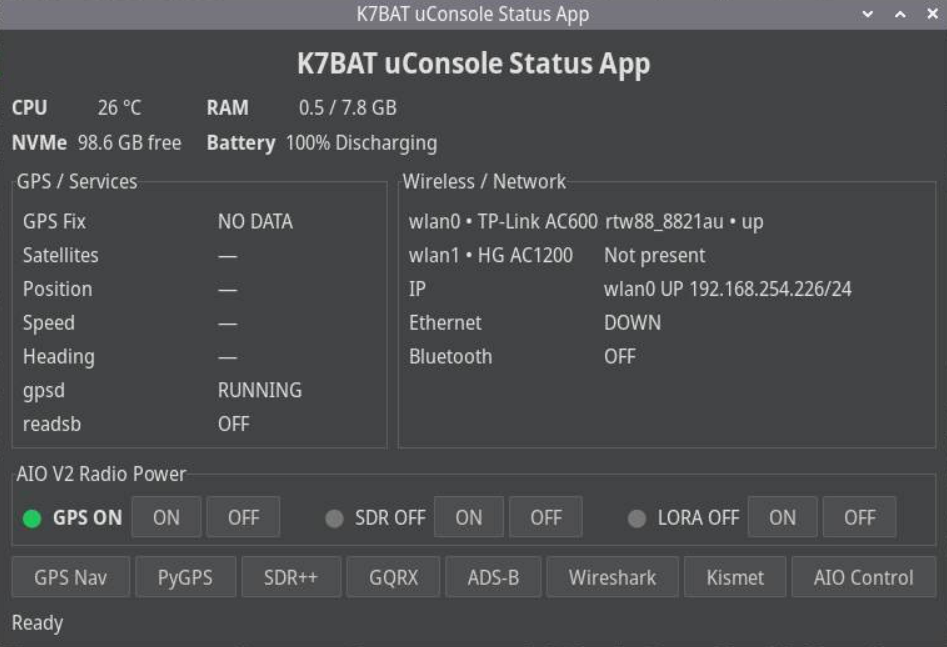
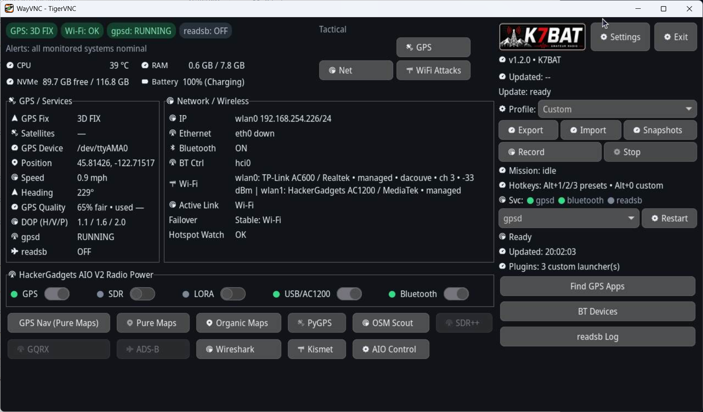

# K7BAT uConsole Status App


Field computer dashboard and Sidekick companion API for ClockworkPi uConsole systems. The Status App is designed for small-screen field operation: system health, GPS, network, radios, launchers, plugins, diagnostics, and Sidekick device provisioning are available from one GTK3 interface.





The current release is K7BAT Status App `v2.0.4`, tagged in Git as `v2.0.4`.

## Features

### Status App

- GTK3 dashboard optimized for ClockworkPi uConsole displays.
- Status tabs for system, network, GPS, plugins, and TaskManager details.
- Main-page launcher controls for GPS navigation, Sidekick Manager, SDR, radio, and installed tools.
- Minimize control to return to the desktop without stopping the application.
- Exit and fullscreen controls, including keyboard-friendly operation.
- Live CPU temperature, memory, disk, battery, GPS, Wi-Fi, Ethernet, Bluetooth, and service state reporting.
- TaskManager view with uptime, load averages, memory/disk details, service states, and top processes sorted by CPU.
- Hardware-aware Power & Radios controls for GPS, SDR, LoRa, USB/AC1200, and Bluetooth where supported.
- GPS quality data including fix, satellites, position, speed, track, DOP, and trend information.
- Network details including active link, Wi-Fi trend, failover, hotspot watchdog, Bluetooth controller, and interface state.
- Profile presets, alert thresholds, touch mode, high contrast mode, day/night theme, snapshots, and mission recording.

### Launchers and plugins

- Built-in launchers are enabled only when their dependencies are detected.
- Plugin manager supports bundled and user-installed Python or shell plugins.
- Sidekick Manager opens as a separate window for ESP32 provisioning.
- Sidekick Setup provisions Wi-Fi, uConsole server address, firmware, and the Sidekick API token over USB serial.
- Remote Assist can create a diagnostics bundle for support.
- Optional tools include Navit, Pure Maps, Organic Maps, OSM Scout, SDR++, GQRX, Wireshark, Kismet, PyGPSClient, and other field utilities.

### Companion API

- Legacy `/api` endpoints remain available during migration.
- Versioned Sidekick contract under `/api/v2`.
- Full normalized status snapshot and domain endpoints for system, GPS, network, radio, ADS-B, Meshtastic, apps, profiles, and screens.
- Device registration and heartbeat.
- Six-digit device enrollment:
	- `POST /api/v2/device/enroll/start`
	- `POST /api/v2/device/enroll/confirm`
- API-key authentication for device operations.
- API version discovery through `GET /api/v2/version`, including `status_app_version`.
- Readiness check through `GET /api/v2/ready`.
- Device config, revocation, command jobs, and audit records in the expanded API implementation.
- REST polling fallback; `/ws/v2` is reserved for the future live event broker.

See [app/api_v2_sidekickRW.md](app/api_v2_sidekickRW.md) for the complete Sidekick contract, enrollment flow, LVGL state machine, and PlatformIO implementation guide.

## Architecture

```text
uConsole Linux services
				|
				v
K7BAT normalized status model
				|
				+-- GTK3 Status App
				+-- REST /api and /api/v2
				+-- Sidekick Setup over USB serial
				+-- ESP32 Sidekick over Wi-Fi
```

The uConsole remains authoritative. Sidekick devices display telemetry and issue approved commands; they do not manage Linux services directly.

## Supported platform

- ClockworkPi uConsole
- Debian 13 Trixie recommended
- Raspberry Pi CM4 or CM5
- labwc/Wayland desktop; X11-capable environments are also supported
- Optional HackerGadgets AIO V2 and AC1200 hardware
- Python 3, GTK3, PyGObject, gpsd, NetworkManager, BlueZ, and standard Linux process tools

Optional hardware and applications are detected dynamically. The dashboard remains usable when GPS, SDR, AIO, or secondary adapters are unavailable.

## Installed system requirements

The installer uses Debian `apt` and currently requests these packages when they are available:

| Package | Purpose |
| --- | --- |
| `python3` | Runtime for the Status App, API, plugins, and tools |
| `python3-gi` | Python GObject bindings |
| `gir1.2-gtk-3.0` | GTK3 desktop interface |
| `librtaudio7` | SDR++ audio compatibility |
| `gpsd` | GPS daemon and serial GPS integration |
| `gpsd-clients` | `cgps` and GPS troubleshooting tools |
| `iproute2` | Network/interface inspection |
| `iw` | Wi-Fi radio and interface inspection |
| `ethtool` | Ethernet and wireless driver diagnostics |
| `bluez` | Bluetooth service and controller management |
| `procps` | Process, uptime, and TaskManager data |
| `usbutils` | USB/AIO/AC1200 hardware inspection |
| `desktop-file-utils` | Desktop launcher registration |
| `libglib2.0-bin` | GLib desktop integration utilities |

The installer continues with warnings when an optional package is unavailable instead of failing the entire application install.

## Hardware integrations

### ClockworkPi uConsole

The primary target is a ClockworkPi uConsole running Debian on Raspberry Pi CM4 or CM5. The app supports Wayland/labwc and X11-capable environments.

### HackerGadgets AIO V2

When `aiov2_ctl` is available, the app can detect and control supported power rails and hardware states:

- GPS
- SDR
- LoRa
- USB/AC1200
- Bluetooth dependency state

Actions are delegated to the local `aiov2_ctl` command and remain disabled or marked unavailable when the hardware is absent.

### AC1200 / MT7921U

The AC1200 diagnostics integration checks USB presence, wireless interface state, controller information, driver data, and Bluetooth dependencies. The diagnostic implementation is in `app/ac1200_diagnostics.py` and is also installed as:

```bash
k7bat-ac1200-diagnostics --help
```

### GPS

GPS data is collected through `gpsd`. Useful diagnostics:

```bash
cgps -s
gpspipe -w
systemctl status gpsd gpsd.socket
```

The installer preserves an existing gpsd device configuration and avoids changing it unless valid NMEA data is detected.

## Services and background processes

The app observes and can request restarts for common services:

- `gpsd`
- `gpsd.socket`
- `bluetooth`
- `readsb`
- `NetworkManager`
- the K7BAT Status API on port `8080`

The TaskManager tab displays service state, uptime, load, memory, disk, and top processes. Service control uses non-interactive sudo and the installer creates a limited sudoers policy for `systemctl` when a desktop user is detected.

Check service state manually:

```bash
systemctl status gpsd gpsd.socket bluetooth readsb NetworkManager
pgrep -af 'status_api.py|k7bat-uconsole-status.py'
ss -ltnp | grep ':8080'
```

## Optional tools and integrations

The launcher system detects optional commands and disables buttons when dependencies are missing.

Common optional packages:

```bash
sudo apt install navit wireshark kismet gqrx-sdr
```

Other supported or detected tools include:

- SDR++
- PyGPSClient
- Pure Maps
- Organic Maps
- OSM Scout
- Hak5 Pineapple modules
- Wi-Fi assessment tools
- Reaver/WPS tooling
- packet/APRS/radio utilities supplied by the user

The installer applies SDR++ compatibility fixes when `scripts/install-sdrpp-fixes.sh` is present. The SDRDecoder plugin can be installed separately from its external Git repository under the user plugin configuration directory.

## Configuration and data locations

| Path | Contents |
| --- | --- |
| `/home/bcaddy/uconsole-k7bat` | Canonical installed application tree |
| `~/.config/k7bat-uconsole-status/settings.json` | App settings, profiles, alerts, theme, and launcher choices |
| `~/.config/k7bat-uconsole-status/snapshots/` | Named profile/settings snapshots |
| `~/.config/k7bat-uconsole-status/missions/` | Mission telemetry JSONL and summaries |
| `~/.config/k7bat-uconsole-status/backups/` | Update/rollback metadata |
| `~/.config/k7bat-uconsole-status/plugins.json` | User plugin launcher configuration |
| `~/.config/k7bat-sidekick-setup/settings.json` | Saved Sidekick setup values; protected with mode `600` |
| `~/.local/share/k7bat-uconsole-status/startup.log` | Status App startup and diagnostics log |
| `~/.local/share/k7bat-sidekick-setup/launcher.log` | Sidekick setup launcher log |
| `/home/bcaddy/uconsole-k7bat/.apikey` | Persistent Sidekick API key; never publish or log its contents |

## Diagnostics and support bundle

The repository includes diagnostics and troubleshooting helpers:

```bash
sudo ./scripts/diagnostics.sh
./scripts/create-diagnostics-bundle.sh
./scripts/sidekick_serial_diagnose.py
./scripts/sidekick_acm_probe.py
./scripts/monitor-sidekick-api.sh
./scripts/verify-sidekick-api.sh
```

The Remote Assist plugin can create a support bundle from inside the Status App. Treat generated bundles as sensitive because they may contain network, service, hardware, and configuration information.

## Plugin development

Python plugins live in `app/plugins/` and are loaded by `plugin_manager.py`. User plugins can live under:

```text
/home/bcaddy/uconsole-k7bat/plugins/
~/.config/k7bat-uconsole-status/plugins/
```

The plugin manifest is `app/plugins.json`; the installer also provides `assets/plugins.default.json` as a fallback starter set. Plugin import and loader checks are available under `scripts/tests/`.

## API operation

Start the canonical API manually:

```bash
python3 /home/bcaddy/uconsole-k7bat/status_api.py --host 0.0.0.0 --port 8080
```

Useful checks:

```bash
curl http://127.0.0.1:8080/api/v2/health
curl http://127.0.0.1:8080/api/v2/ready
curl http://127.0.0.1:8080/api/v2/version
curl http://127.0.0.1:8080/api/v2/capabilities
curl http://127.0.0.1:8080/api/v2/status
```

The API uses REST polling as its current reliable transport. The `/ws/v2` path is reserved for the future WebSocket event broker.

## Installation

On the uConsole:

```bash
git clone https://github.com/OpieTaylor911/k7bat_uconsole_core.git
cd k7bat_uconsole_core
git checkout v2.0.4
chmod +x install.sh scripts/*.sh
sudo ./install.sh
```

The installer:

1. Detects the active desktop user.
2. Installs required Debian packages, including GTK3, PyGObject, gpsd, BlueZ, networking, and process tooling.
3. Installs the Status App and API under `/home/bcaddy/uconsole-k7bat`.
4. Installs the `k7bat-uconsole-status` launcher and desktop entry.
5. Installs optional plugin and widget assets.
6. Preserves existing gpsd configuration and only applies conservative GPS setup when valid NMEA data is detected.

Launch the dashboard:

```bash
k7bat-uconsole-status
```

Launch Sidekick Manager:

```bash
k7bat-sidekick-setup
```

Upgrade an existing installation by running the installer again:

```bash
sudo ./install.sh
```

Uninstall:

```bash
sudo ./uninstall.sh
```

## Sidekick enrollment

1. Start the Status API on the uConsole.
2. Open **Sidekick Manager** or use the Sidekick Setup launcher.
3. Begin enrollment on the uConsole to obtain a six-digit pairing code.
4. Enter the code in the Sidekick setup flow.
5. The uConsole confirms the device and issues its API key.
6. The Sidekick stores the key and uses it for authenticated API calls.

API version check:

```bash
curl http://uconsole:8080/api/v2/version
```

Expected fields include:

```json
{
	"api_version": "2.0",
	"status_app_version": "2.0.4"
}
```

For ESP32/LVGL/PlatformIO implementation details, see the [Sidekick API guide](app/api_v2_sidekickRW.md).

## API smoke test

Run the local contract tests:

```powershell
Push-Location app
python -m unittest test_status_api_v2.py
Pop-Location
```

Exercise a live API:

```bash
python3 app/sidekick_device_test.py \
	--base-url http://127.0.0.1:8080 \
	--device-id sidekick-test-001 \
	--name "K7BAT Sidekick Test" \
	--board CYD_3248S035R
```

## Diagnostics

```bash
cgps -s
iw dev
nmcli device status
ethtool -i wlan1
```

Optional packages for additional launchers:

```bash
sudo apt install navit wireshark kismet gqrx-sdr
```

## Repository layout

```text
app/                         Core Status App, API, tests, and plugins
app/api_v2_sidekickRW.md    Sidekick REST/LVGL/PlatformIO contract
app/sidekick_device_test.py Sidekick API smoke test
assets/                     Desktop launcher assets
docs/                        API, Sidekick, plugin, and release documentation
assets/screenshots/         Status App screenshots
install.sh                  Debian/uConsole installer
k7bat-uconsole-status       Local launcher wrapper
```

## License

MIT. See [LICENSE](LICENSE).

Created by **K7BAT** for the ClockworkPi/uConsole community.
